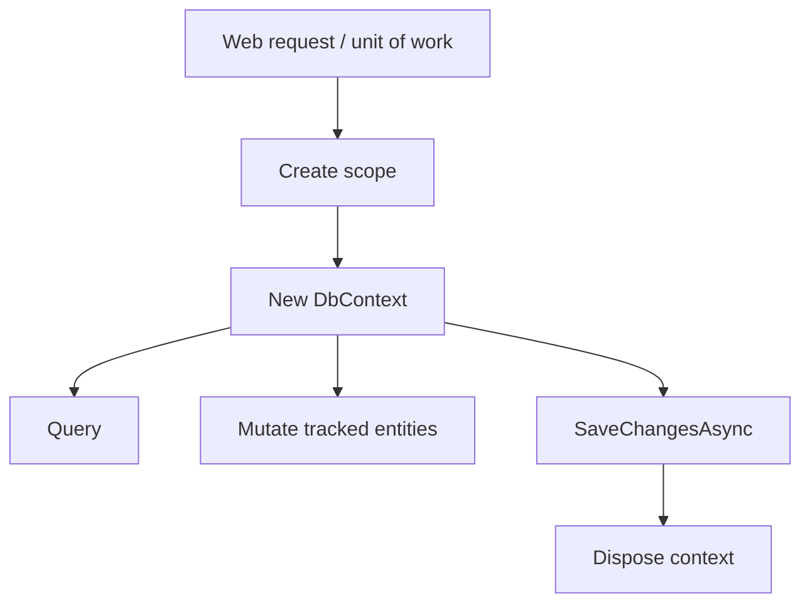

# DbContext and Entities: The Heart of EF Core

## 🧠 Intuition

A **`DbContext`** is your session with the database. It holds the connection, the model
configuration, the **change tracker** (the bit that watches your entities for modifications), and
exposes `DbSet<T>` properties for each entity type. **Entities** are plain C# classes that map to
tables. You query a `DbSet<T>` like a collection, modify the returned objects, and the `DbContext`
quietly records what changed so it can save it.

> 💡 **Analogy — a unit-of-work clipboard.** You staple all the changes you want to make onto a
> clipboard (`DbContext`). When you call `SaveChangesAsync()`, the office (the database) processes
> them in one trip. Throw the clipboard away when you're done — don't keep one for the whole
> office's lifetime.

## 🎯 The Problem

```csharp
// ❌ Before: long-lived, shared, untested DbContext
public class BadService {
    // Singleton DbContext shared across requests and threads
    private static readonly BloggingContext _ctx = new();
    public async Task<Blog?> GetAsync(int id) => await _ctx.Blogs.FindAsync(id);
}
```

`DbContext` is **not thread-safe** and **not designed to be long-lived**. Sharing one across
requests leaks tracked entities, blocks itself under concurrent calls, and makes connection /
transaction lifetimes a mystery.

## 📐 The right shape



One `DbContext` per **logical unit of work** — typically one per web request. In ASP.NET Core,
`AddDbContext` registers it as **scoped** for you, and the framework disposes it at the end of the
request.

## 💻 C# Implementation

### A modern `DbContext`

```csharp
public class BloggingContext : DbContext {
    public DbSet<Blog> Blogs => Set<Blog>();
    public DbSet<Post> Posts => Set<Post>();

    public BloggingContext(DbContextOptions<BloggingContext> options) : base(options) { }

    protected override void OnModelCreating(ModelBuilder modelBuilder) {
        // Configure the model here, or load IEntityTypeConfiguration<T> classes:
        modelBuilder.ApplyConfigurationsFromAssembly(typeof(BloggingContext).Assembly);
    }
}
```

Three habits worth adopting:
- **`Set<T>()` over `{ get; set; }`** — avoids nullability warnings on `DbSet<T>` properties.
- **Inject `DbContextOptions<T>` via the constructor** — keeps the connection string / provider in
  config, not source.
- **`ApplyConfigurationsFromAssembly`** — keeps `OnModelCreating` small; per-entity configuration
  lives in its own class.

### A clean entity

```csharp
public class Blog {
    public int Id { get; set; }
    public string Title { get; set; } = "";
    public int Views { get; set; }

    // Navigation property — collection of children
    public List<Post> Posts { get; set; } = new();
}
```

Conventions EF picks up for free:
- `Id` (or `<ClassName>Id`) → the primary key, with identity generation on relational providers.
- `string` → `nvarchar(max)` (SQL Server) / `text` (Postgres) — usually too wide; constrain it (next file).
- `int` → `int NOT NULL`; `int?` → nullable.
- `List<Post>` → a one-to-many relationship to `Post` (with `BlogId` as the inferred FK).

> See [Configuring the Model](02.Configuring-the-Model.md) for **data annotations vs Fluent API
> vs `IEntityTypeConfiguration<T>`** — and why the last one is the senior default.

### Registering it in DI

```csharp
builder.Services.AddDbContext<BloggingContext>(opt =>
    opt.UseSqlServer(builder.Configuration.GetConnectionString("Default")));
```

Lifetimes:
- **`AddDbContext`** → scoped (one per request). The default and right for most apps.
- **`AddDbContextPool`** → scoped, but reuses pre-created contexts → faster startup per request.
  Some restrictions (see [DbContext Pooling](../05-Performance/02.DbContext-Pooling.md)).
- **`AddDbContextFactory`** → exposes `IDbContextFactory<T>` so you can create short-lived
  contexts in background services or per-operation. Indispensable for Blazor Server too.

## ⚖️ The change tracker (in 30 seconds)

When you query without `AsNoTracking()`, EF stores a snapshot of each returned entity. When you
call `SaveChangesAsync()`, it compares each entity's current state to the snapshot and emits the
right SQL. This is what enables `blog.Views++` to become a one-column `UPDATE`.

States an entity can be in: **Added · Unchanged · Modified · Deleted · Detached**.

| Operation | Resulting state |
|-----------|-----------------|
| `ctx.Blogs.Add(new Blog())` | Added |
| `ctx.Blogs.FirstAsync(...)` | Unchanged (tracked) |
| Mutate a tracked entity's property | Modified |
| `ctx.Blogs.Remove(blog)` | Deleted |
| `AsNoTracking().FirstAsync(...)` | Detached |

Full tour in [Change Tracking](../03-Saving-and-Concurrency/01.Change-Tracking.md).

## 🚫 Common DbContext mistakes

```csharp
// ❌ Hard-coding the provider in OnConfiguring (bypasses DI, leaks secrets)
protected override void OnConfiguring(DbContextOptionsBuilder o) {
    o.UseSqlServer("Server=...;Password=hunter2;...");
}
// ✅ inject options via constructor (see above), supply provider/connection from the host

// ❌ A static / singleton DbContext shared across requests
private static readonly BloggingContext _ctx = new();
// ✅ scoped per request: AddDbContext<BloggingContext>(...)

// ❌ Forgetting to dispose a context created with `new` (manual DI bypass)
var ctx = new BloggingContext(options);   // who disposes this?
// ✅ in DI: framework disposes it
// ✅ manually: `using var ctx = factory.CreateDbContext();` or `await using`

// ❌ Calling SaveChangesAsync in a loop
foreach (var b in blogs) { ctx.Blogs.Add(b); await ctx.SaveChangesAsync(); }
// ✅ batch
ctx.Blogs.AddRange(blogs); await ctx.SaveChangesAsync();
```

## 🆕 Latest EF Notes (8 / 9 / 10)

- **EF 8:** `Set<T>()` style was already idiomatic; primary constructors on entity classes also
  began to play nicely with EF.
- **EF 9:** the **MSBuild compiled model** (`<EFOptimizeContext>true</EFOptimizeContext>` in your
  `.csproj`) makes large models start up substantially faster. Especially helpful for cold-start
  scenarios.
- **EF 10:** `DbContext` lifetime/usage hasn't changed conceptually, but **named query filters**
  (see [Global & Named Filters](08.Global-and-Named-Query-Filters.md)) and **vector data**
  (see [Vector Data](12.Vector-Data-for-AI.md)) are new things you'll configure here.

## 🌍 Real-world production tips

- **One `DbContext` type per bounded context** (DDD-style). Don't dump every entity into one mega
  context if your app has clear domains.
- **No business logic in `DbContext`** — keep it boring. Override `SaveChangesAsync()` only for
  cross-cutting concerns (audit timestamps, soft delete), or use [interceptors](../03-Saving-and-Concurrency/06.Interceptors-and-SaveChanges-Hooks.md).
- **`SaveChangesAsync` returns the number of state entries written** — useful for asserts.
- Always pass a `CancellationToken` to async EF methods in server code.

## 🎯 Practice (with full solutions)

### 1. Fix the lifetime bug — `Easy`
**Smelly code:** the `BadService` from the Problem above.
**Task:** rewrite using constructor injection and a per-request `DbContext`.
**Solution:**
```csharp
public class BlogService {
    private readonly BloggingContext _ctx;
    public BlogService(BloggingContext ctx) => _ctx = ctx;
    public Task<Blog?> GetAsync(int id) => _ctx.Blogs.FindAsync(id).AsTask();
}
// Program.cs
builder.Services.AddDbContext<BloggingContext>(opt =>
    opt.UseSqlServer(builder.Configuration.GetConnectionString("Default")));
builder.Services.AddScoped<BlogService>();
```
**Why it's better:** scoped lifetime (one per request), test-friendly (override `BloggingContext`
in tests), no shared mutable state across threads.

### 2. Add a base class for timestamps — `Medium`
**Task:** every entity should auto-populate `CreatedUtc` and `UpdatedUtc` without each property
being set manually.
**Solution:**
```csharp
public abstract class BaseEntity {
    public DateTime CreatedUtc { get; set; }
    public DateTime UpdatedUtc { get; set; }
}

public class BloggingContext : DbContext {
    public DbSet<Blog> Blogs => Set<Blog>();
    public BloggingContext(DbContextOptions<BloggingContext> o) : base(o) { }

    public override Task<int> SaveChangesAsync(CancellationToken ct = default) {
        var now = DateTime.UtcNow;
        foreach (var entry in ChangeTracker.Entries<BaseEntity>()) {
            if (entry.State == EntityState.Added) entry.Entity.CreatedUtc = now;
            if (entry.State is EntityState.Added or EntityState.Modified)
                entry.Entity.UpdatedUtc = now;
        }
        return base.SaveChangesAsync(ct);
    }
}
public class Blog : BaseEntity { public int Id { get; set; } public string Title { get; set; } = ""; }
```
**Why it's better:** one place sets timestamps for every entity. (For a multi-context solution and
testability, prefer a [SaveChanges interceptor](../03-Saving-and-Concurrency/06.Interceptors-and-SaveChanges-Hooks.md) instead.)

## ✅ Key Takeaways

- `DbContext` = your **unit of work**: connection + model + change tracker + `DbSet<T>` properties.
- Entities are plain C# classes; EF infers a lot by **convention** (PK, navigations, FKs).
- Treat `DbContext` as **scoped, short-lived, not thread-safe**. Inject `DbContextOptions<T>`.
- Keep `OnModelCreating` tidy with **`ApplyConfigurationsFromAssembly`** and `IEntityTypeConfiguration<T>`.
- Lifetimes: **`AddDbContext`** (default), **`AddDbContextPool`** (perf), **`AddDbContextFactory`**
  (background work / Blazor Server).

**Self-check:**
1. Why is a singleton `DbContext` dangerous?
2. What are the five `EntityState` values and when does each apply?
3. When would you choose `AddDbContextFactory` over `AddDbContext`?

---
◀ Prev: [Module index](README.md) · ▲ [Module index](README.md) · ▶ Next: [Configuring the Model](02.Configuring-the-Model.md)
