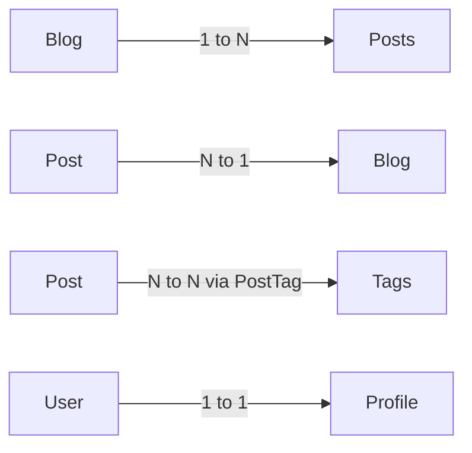

# Relationships: One-to-Many, Many-to-Many, One-to-One

## 🧠 Intuition

Most domains are connected — a blog has posts, an order has line items, a user has roles. EF Core
models these with **navigation properties** in C# (collections or single references) and **foreign
keys** in the database. You configure them once; queries with `Include`, cascading deletes, and
many-to-many joins all just work.

> 💡 **Mental model:** the *navigation* is the C# convenience; the *foreign key* is the SQL
> reality. EF needs to know both sides to translate between them.

## 🎯 The Problem

```csharp
// ❌ Before: no navigations, every "give me a blog's posts" is a manual join in LINQ or SQL
public class Blog { public int Id { get; set; } public string Title { get; set; } = ""; }
public class Post { public int Id { get; set; } public int BlogId { get; set; } public string Heading { get; set; } = ""; }

var posts = ctx.Posts.Where(p => p.BlogId == blogId).ToList();   // every caller writes this
```

It works, but you lose the whole point of an ORM: working with **objects that already know how
they relate**.

## 📐 The shapes



| Shape | What it means | Typical C# |
|-------|---------------|-----------|
| **One-to-many (1 ↔ N)** | One blog has many posts | `List<Post>` on `Blog`, `Blog`/`BlogId` on `Post` |
| **Many-to-one (N ↔ 1)** | Many posts belong to one blog | the inverse of above |
| **Many-to-many (N ↔ N)** | Posts have tags, tags have many posts | `List<Tag>` on `Post`, `List<Post>` on `Tag` |
| **One-to-one (1 ↔ 1)** | Each user has exactly one profile | Reference on both sides |

## 💻 One-to-Many (the most common)

```csharp
public class Blog {
    public int Id { get; set; }
    public string Title { get; set; } = "";
    public List<Post> Posts { get; set; } = new();          // navigation: many
}
public class Post {
    public int Id { get; set; }
    public string Heading { get; set; } = "";
    public int BlogId { get; set; }                         // FK
    public Blog Blog { get; set; } = null!;                 // navigation: one
}

// Fluent (in IEntityTypeConfiguration<Blog>) — explicit is good
public void Configure(EntityTypeBuilder<Blog> b) {
    b.HasMany(x => x.Posts)
     .WithOne(p => p.Blog)
     .HasForeignKey(p => p.BlogId)
     .OnDelete(DeleteBehavior.Cascade);
}
```

EF would have inferred most of this from convention (`BlogId` → FK to `Blog.Id`). Being explicit
matters when you have **multiple references** to the same entity (e.g. `Author` and `Editor` both
pointing to `User`).

## 💻 Many-to-Many — the "skip navigation" form (EF 5+)

```csharp
public class Post {
    public int Id { get; set; }
    public List<Tag> Tags { get; set; } = new();            // navigates DIRECTLY to Tag
}
public class Tag {
    public int Id { get; set; }
    public string Name { get; set; } = "";
    public List<Post> Posts { get; set; } = new();
}

// Fluent (optional — convention works for the simple case)
modelBuilder.Entity<Post>()
    .HasMany(p => p.Tags)
    .WithMany(t => t.Posts)
    .UsingEntity("PostTag");                                // EF creates the join table automatically
```

EF generates a `PostTag(PostId, TagId)` join table. You get to navigate Post → Tags without
modeling the join in C#. If you need extra columns on the join (e.g. `TaggedAtUtc`), you can use a
**join entity**:

```csharp
public class PostTag {
    public int PostId { get; set; }
    public int TagId { get; set; }
    public DateTime TaggedAtUtc { get; set; }
}
modelBuilder.Entity<Post>()
    .HasMany(p => p.Tags).WithMany(t => t.Posts)
    .UsingEntity<PostTag>(
        j => j.HasOne<Tag>().WithMany().HasForeignKey(x => x.TagId),
        j => j.HasOne<Post>().WithMany().HasForeignKey(x => x.PostId));
```

## 💻 One-to-One

```csharp
public class User {
    public int Id { get; set; }
    public Profile? Profile { get; set; }
}
public class Profile {
    public int Id { get; set; }
    public int UserId { get; set; }
    public User User { get; set; } = null!;
}
modelBuilder.Entity<User>()
    .HasOne(u => u.Profile)
    .WithOne(p => p.User)
    .HasForeignKey<Profile>(p => p.UserId);
```

The trick with 1-1 is telling EF **which side holds the FK** (`HasForeignKey<Profile>(...)` does
that). Without it, EF can't infer the principal/dependent.

## ⚡ Generated SQL — what `Include` actually does

```csharp
var blogs = await ctx.Blogs
    .Include(b => b.Posts)
    .Where(b => b.Views > 1000)
    .ToListAsync();
```

EF emits a single query with `LEFT JOIN`:
```sql
SELECT [b].[Id], [b].[Title], [b].[Views], [p].[Id], [p].[BlogId], [p].[Heading]
FROM [Blogs] AS [b]
LEFT JOIN [Posts] AS [p] ON [b].[Id] = [p].[BlogId]
WHERE [b].[Views] > 1000
ORDER BY [b].[Id];
```

If you include **two** collection navigations, you risk a **cartesian explosion** — use
`AsSplitQuery()` (see [Split Queries](../02-Querying/04.Split-Queries.md)) to emit one query per
collection instead.

## ⚖️ Delete behaviors (the hidden footgun)

When you delete a principal (`Blog`), what happens to dependents (`Posts`)?

| `DeleteBehavior` | Meaning |
|------------------|---------|
| `Cascade` | DB deletes children automatically — EF's default for **required** relationships |
| `Restrict` | DB blocks the delete if children exist |
| `SetNull` | DB sets the FK to NULL — requires nullable FK |
| `ClientSetNull` | EF nullifies tracked children; DB does nothing — default for **optional** relationships |
| `NoAction` | DB raises an error; no cascading |

> ⚠️ SQL Server **rejects multiple cascade paths** to the same row (the "multiple cascade paths"
> error). When that happens, switch one of them to `Restrict` or `NoAction`. Full story in
> [Cascade Delete](../03-Saving-and-Concurrency/04.Cascade-Delete.md).

## 🆕 Latest EF Notes (8 / 9 / 10)

- **EF 8:** skip navigations and join entities are stable and idiomatic; **HierarchyId** opens
  tree-like relationships on SQL Server.
- **EF 9:** improvements to relationship discovery for complex cases.
- **EF 10:** **`LeftJoin`** / **`RightJoin`** LINQ operators (matching .NET 10) make manual
  joins much cleaner — see [Advanced Querying](../02-Querying/02.Advanced-Querying.md).

## 🌍 Real-world production tips

- **Avoid lazy loading by default** — it's a top source of N+1. Use `Include` or projections.
- **Always specify cascade behavior** for important hierarchies. Default `Cascade` on every
  relationship can wipe out data unexpectedly.
- **One-to-many with bag semantics**: use `List<T>` or `HashSet<T>`. Avoid `IEnumerable<T>` (EF
  needs to add/remove).
- **Required vs optional FK** is decided by **nullability** of the FK property: `int BlogId` →
  required, `int? BlogId` → optional.

## 🎯 Practice (with full solutions)

### 1. Configure a many-to-many with payload — `Medium`
**Scenario:** `Post` has many `Tag`s; you also need to record **who** tagged it.
**Solution:**
```csharp
public class PostTag {
    public int PostId { get; set; } public int TagId { get; set; }
    public int TaggedByUserId { get; set; }
    public DateTime TaggedAtUtc { get; set; }
}
modelBuilder.Entity<Post>()
    .HasMany(p => p.Tags).WithMany(t => t.Posts)
    .UsingEntity<PostTag>(
        j => j.HasOne<Tag>().WithMany().HasForeignKey(x => x.TagId),
        j => j.HasOne<Post>().WithMany().HasForeignKey(x => x.PostId),
        j => j.HasKey(x => new { x.PostId, x.TagId }));
```
**Why it's better:** the join is a first-class entity, so you can query it directly
(`ctx.Set<PostTag>().Where(...)`) and store extra columns.

### 2. Two FKs to the same table — `Medium`
**Scenario:** `Post` has both an **Author** and an **Editor**, both `User`.
**Solution:**
```csharp
public class Post {
    public int Id { get; set; }
    public int AuthorId { get; set; } public User Author { get; set; } = null!;
    public int? EditorId { get; set; } public User? Editor { get; set; }
}
modelBuilder.Entity<Post>()
    .HasOne(p => p.Author).WithMany().HasForeignKey(p => p.AuthorId).OnDelete(DeleteBehavior.Restrict);
modelBuilder.Entity<Post>()
    .HasOne(p => p.Editor).WithMany().HasForeignKey(p => p.EditorId).OnDelete(DeleteBehavior.SetNull);
```
**Why it's better:** EF can't guess which navigation maps to which FK when there are two — explicit
Fluent removes the ambiguity, and the delete behaviors reflect business rules (can't delete an
author with posts; clear the editor link).

## ✅ Key Takeaways

- Model the **navigations** in C#; EF infers the FK columns from conventions, or you specify them
  with Fluent.
- **Many-to-many** can be modeled with skip navigations + an EF-created join, or with a join entity
  if you need extra columns.
- **One-to-one** requires telling EF which side holds the FK.
- `Include` emits a `LEFT JOIN`; multiple collection includes can cause **cartesian explosion** —
  use `AsSplitQuery`.
- **Cascade delete is the default for required relationships** — make it deliberate.

**Self-check:**
1. What's the difference between a skip navigation and a join entity?
2. What does EF use to decide if a relationship is required vs optional?
3. What does `Include` emit, and when can it bite you?

---
◀ Prev: [Configuring the Model](02.Configuring-the-Model.md) · ▲ [Module index](README.md) · ▶ Next: [Owned Entities & Complex Types](04.Owned-Entities-and-Complex-Types.md)
