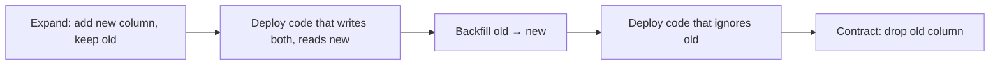

# Migrations in Production

## 🧠 Intuition

In development, `dotnet ef database update` is fine. In production — multiple app instances, real
data, uptime requirements, change-control — you need migrations that are **idempotent**
(safe to run more than once), **reviewable** (a human or CI approves the SQL), and **decoupled
from app startup** (so deploys don't race). EF gives you SQL scripts and migration bundles for
exactly this.

> 💡 The golden rule: **the application should never migrate the database as a side effect of
> starting up.** Migration is a deliberate, gated deployment step.

## 🎯 The Problem

```csharp
// ❌ Before: migrate-on-startup in a horizontally-scaled service
public static async Task Main(string[] args) {
    var app = builder.Build();
    using var scope = app.Services.CreateScope();
    await scope.ServiceProvider.GetRequiredService<BloggingContext>().Database.MigrateAsync();
    app.Run();
}
```

Deploy 5 replicas → 5 instances race to migrate. Best case, one wins and the rest error. Worst
case, partial migration on a locked table while users get 500s. No review, no rollback plan.

## 💻 Idempotent SQL scripts (the workhorse)

```bash
dotnet ef migrations script --idempotent --output migrate.sql
```

The `--idempotent` flag wraps each migration in a check against the `__EFMigrationsHistory` table:

```sql
IF NOT EXISTS (SELECT 1 FROM [__EFMigrationsHistory] WHERE [MigrationId] = N'20260101_AddRating')
BEGIN
    ALTER TABLE [Blogs] ADD [Rating] int NOT NULL DEFAULT 0;
    INSERT INTO [__EFMigrationsHistory] ([MigrationId], [ProductVersion]) VALUES (N'20260101_AddRating', N'10.0.0');
END
```

Run it as many times as you like — already-applied migrations are skipped. Hand it to a DBA, run
it in a release pipeline, or check it into change control.

```bash
# Generate a script for a specific range (e.g. only what's new since the last release)
dotnet ef migrations script LastReleaseMigration --idempotent --output delta.sql
```

## 💻 Migration bundles (self-contained executable)

```bash
dotnet ef migrations bundle --self-contained -r linux-x64 --output efbundle
```

This produces a small executable that applies pending migrations without the SDK or your project
on the target machine:

```bash
./efbundle --connection "Server=...;Database=Prod;..."
```

Bundles are ideal for **CI/CD**: build once, run as a discrete pipeline step against each
environment, no `dotnet ef` tooling required on the server.

## 💻 Zero-downtime: the expand-contract pattern

Rolling deployments run **old and new code simultaneously** for a window. A migration that breaks
the old code (renaming/dropping a column it still reads) causes errors during that window. The
fix is **expand-contract** (a.k.a. parallel change):



Example — renaming `Name` to `Title`:
1. **Expand:** add `Title`, keep `Name`. Migration only *adds*.
2. **Deploy** code that writes both, reads `Title`.
3. **Backfill** `Title = Name` for old rows (an `ExecuteUpdate` or SQL script).
4. **Deploy** code that no longer references `Name`.
5. **Contract:** drop `Name` in a later migration.

Each step is backward-compatible, so old and new instances coexist safely. Detail in
[Versioning & Schema Evolution](03.Versioning-and-Schema-Evolution.md).

## ⚖️ Strategy comparison

| Approach | Review? | Multi-instance safe? | Rollback? | Use when |
|----------|---------|---------------------|-----------|----------|
| `MigrateAsync()` on startup | ❌ | ❌ (races) | ❌ | Dev / single-instance demos only |
| `--idempotent` SQL script | ✅ | ✅ (one runner) | Manual | DBA-gated, change-controlled shops |
| Migration **bundle** | ✅ | ✅ (one runner) | Manual | CI/CD pipelines |
| Expand-contract migrations | ✅ | ✅ | ✅ (designed in) | Zero-downtime rolling deploys |

## 🚫 Common mistakes

```bash
# ❌ Non-idempotent script run twice → "column already exists" failures
dotnet ef migrations script   # without --idempotent
# ✅ dotnet ef migrations script --idempotent

# ❌ Dropping a column in the same release that still-running old instances read
# ✅ expand-contract: drop only after all old instances are gone
```

```csharp
// ❌ A migration that locks a huge table (adding a NOT NULL column with a computed default)
// → table lock, downtime
// ✅ add nullable first, backfill in batches, then enforce NOT NULL in a later migration
```

## 🆕 Latest EF Notes (8 / 9 / 10)

- **EF 8:** `has-pending-model-changes` CI guard; bundles mature.
- **EF 9:** single-transaction `database update` (later reverted).
- **EF 10:** **reverted to per-step migration application** (no single wrapping transaction) —
  this is the safer default for big/locking migrations and varied deployment topologies.

## 🌍 Real-world production tips

- **Generate idempotent scripts or bundles in CI**; apply them as an explicit, gated step.
- **Never** drop/rename columns in the same deploy that ships code still using them — expand-contract.
- For **big tables**, split risky changes (add nullable → backfill in batches → enforce
  constraint) across migrations to avoid long locks.
- Keep a **rollback script** ready for every release (the `Down` SQL or a hand-written revert).

## 🎯 Practice (with full solutions)

### 1. Replace migrate-on-startup — `Medium`
**Task:** Remove `MigrateAsync()` from `Main` and produce a CI-friendly artifact instead.
**Solution:**
```bash
# In the build pipeline:
dotnet ef migrations bundle --self-contained -r linux-x64 --output efbundle
# In the release pipeline (one runner, gated):
./efbundle --connection "$PROD_CONNECTION"
# App startup no longer migrates.
```
**Why it's better:** one runner applies migrations deliberately; replicas start cleanly; the SQL
was reviewable; rollback is a separate, prepared step.

### 2. Rename a column with zero downtime — `Hard`
**Task:** Rename `Blog.Name` → `Blog.Title` without breaking instances mid-deploy.
**Solution (expand-contract):**
```text
Release 1 (expand):   migration adds Title (nullable); code writes Name AND Title, reads Title.
Between releases:     backfill — UPDATE Blogs SET Title = Name WHERE Title IS NULL;  (ExecuteUpdate or SQL)
Release 2 (contract): migration enforces Title NOT NULL and drops Name; code only uses Title.
```
**Why it's better:** at no point does running code reference a column that doesn't exist. Old and
new instances coexist safely throughout.

## ✅ Key Takeaways

- **Never migrate on startup** in multi-instance production — it races and skips review.
- Use **`migrations script --idempotent`** or **migration bundles** applied as a gated deploy step.
- For zero downtime, use **expand-contract** so old and new code coexist.
- **EF 10** applies migrations **per-step** (reverting EF 9's single transaction) — safer for big
  changes.
- Always have a **rollback** ready.

**Self-check:**
1. Why is migrate-on-startup dangerous with multiple replicas?
2. What does `--idempotent` add to a migration script?
3. Walk through expand-contract for dropping a column.

---
◀ Prev: [Migrations Basics](01.Migrations-Basics.md) · ▲ [Module index](README.md) · ▶ Next: [Versioning & Schema Evolution](03.Versioning-and-Schema-Evolution.md)
