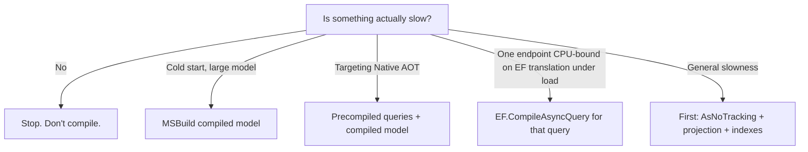

# Compiled & Precompiled Queries (Performance Angle)

> The mechanics live in [02-Querying / Compiled & Precompiled Queries](../02-Querying/06.Compiled-and-Precompiled-Queries.md).
> This file is the **performance decision guide**: when compilation actually pays off, and how to
> prove it.

## 🧠 Intuition

EF already caches the SQL for each query *shape* (the plan cache), so two structurally identical
LINQ queries don't re-translate. Manual **compiled queries** (`EF.CompileAsyncQuery`) cache the
per-call delegate work; **MSBuild compiled models** (EF 9+) move *model building* to build time;
**precompiled queries** (EF 10, toward AOT) move *query translation* to build time. Each removes a
different cost — and each only matters if that cost is actually on your hot path.

> 💡 **Don't compile blindly.** Measure first. The plan cache + `AsNoTracking` + projection beats
> manual compilation for the vast majority of apps.

## 📐 Which cost does each technique remove?

| Cost on the hot path | Technique | Typical win |
|----------------------|-----------|-------------|
| Per-query SQL translation (repeated identical shapes) | **Plan cache** (automatic) | Free — already on |
| Per-call expression-tree + delegate setup on a very hot query | **`EF.CompileAsyncQuery`** | Small CPU/alloc savings at extreme call rates |
| Model build on first request (large model) | **MSBuild compiled model** (EF 9+) | Big **cold-start** win |
| Runtime expression compilation (blocks Native AOT) | **Precompiled queries** (EF 10) | Enables AOT; lower startup |

## 💻 Decision flow



In practice, **(E) fixes most cases.** Reach for compilation only when you've measured the
specific cost it removes.

## 💻 Proving it with BenchmarkDotNet

```csharp
[MemoryDiagnoser]
public class BlogQueryBenchmarks {
    private BloggingContext _ctx = null!;
    private static readonly Func<BloggingContext, int, Task<Blog?>> _compiled =
        EF.CompileAsyncQuery((BloggingContext c, int id) => c.Blogs.AsNoTracking().FirstOrDefault(b => b.Id == id));

    [GlobalSetup] public void Setup() => _ctx = CreateContext();

    [Benchmark(Baseline = true)]
    public Task<Blog?> Normal() => _ctx.Blogs.AsNoTracking().FirstOrDefaultAsync(b => b.Id == 1);

    [Benchmark]
    public Task<Blog?> Compiled() => _compiled(_ctx, 1);
}
```

Run it, look at the **mean time** and **allocations**. If `Compiled` isn't meaningfully better for
*your* query at *your* rates, don't add the indirection.

## ⚖️ Cost/benefit summary

| | Benefit | Cost |
|--|---------|------|
| Plan cache | Free, automatic | None |
| `EF.CompileAsyncQuery` | Lower per-call CPU/alloc | Static state, closure pitfalls, only for fixed shapes |
| MSBuild compiled model | Faster cold start (big models) | Build-time config; regenerate on model change |
| Precompiled queries (EF 10) | AOT-friendly, lower startup | Newer workflow; check current docs |

## 🚫 Common mistakes

```csharp
// ❌ Compiling a query that's already fast — adds maintenance burden for no measurable gain
// ❌ Capturing scoped state in a compiled query (see the Querying chapter's tenant example)
// ❌ Concluding "compiled is faster" from a single un-warmed run — use BenchmarkDotNet with warmup
```

## 🌍 Real-world production tips

- For **serverless / mobile / large models**, turn on the **MSBuild compiled model** first — it's
  the highest-leverage, lowest-risk win.
- For a genuinely **CPU-bound hot endpoint**, profile, then `EF.CompileAsyncQuery` *that* query.
- For **Native AOT**, combine compiled model + EF 10 precompiled queries (per current docs).
- Always keep a **benchmark** so a future "optimization" that regresses gets caught.

## 🎯 Practice (with full solutions)

### 1. Decide whether to compile — `Easy`
**Scenario:** A `GET /blogs/{id}` endpoint is "a bit slow." Profiling shows the time is dominated
by a **missing index** scan, not EF translation.
**Task:** what do you do?
**Solution:** add the index; do **not** compile the query. Compilation removes translation cost,
not scan cost.
```csharp
modelBuilder.Entity<Blog>().HasIndex(b => b.Id);   // (PK already indexed; the real fix is on the actual filtered column)
```
**Why it's better:** you fix the real bottleneck. Compiling here would add complexity and change
nothing.

### 2. Cold-start fix for a 300-entity model — `Easy`
**Task:** First request after deploy is slow because the model takes ~2s to build.
**Solution:** enable the MSBuild compiled model:
```xml
<PropertyGroup>
  <EFOptimizeContext>true</EFOptimizeContext>
  <EFScaffoldModelStage>build</EFScaffoldModelStage>
</PropertyGroup>
```
**Why it's better:** model building moves to compile time; first-request latency drops without
touching query code.

## ✅ Key Takeaways

- The **plan cache** already saves repeated query shapes — free.
- Match the technique to the **specific cost**: model build → compiled model; AOT → precompiled
  queries; extreme per-call CPU → `EF.CompileAsyncQuery`.
- **Most "slow EF" is fixed by no-tracking + projection + indexes**, not compilation.
- **Benchmark** before and after — never assume.

**Self-check:**
1. What cost does the MSBuild compiled model remove vs `EF.CompileAsyncQuery`?
2. Why won't compiling a query fix a missing-index scan?
3. What's the highest-leverage compilation win for a large model?

---
◀ Prev: [DbContext Pooling](02.DbContext-Pooling.md) · ▲ [Module index](README.md) · ▶ Next: [Bulk Operations Performance](04.Bulk-Operations-Performance.md)
