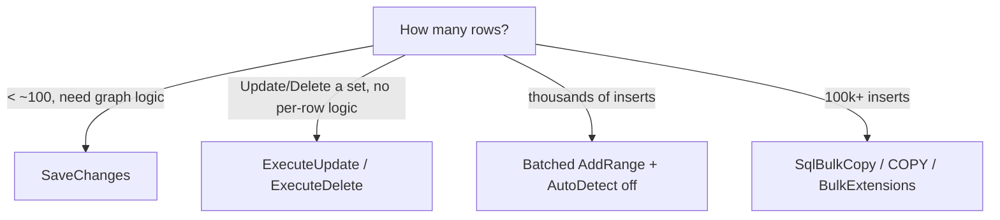

# Bulk Operations Performance

> The API mechanics are in [03-Saving / Bulk Operations](../03-Saving-and-Concurrency/05.Bulk-Operations.md).
> This file is about **choosing the right tool for the volume** — including when EF isn't the
> answer.

## 🧠 Intuition

EF's tracked `SaveChanges` is built for **graphs of a few to a few hundred entities** with full
change tracking and relationship fix-up. Past that, you have three faster gears: **`ExecuteUpdate`/
`ExecuteDelete`** for set-based modifications, **batched `AddRange` + tuned settings** for medium
inserts, and **`SqlBulkCopy` / `COPY`** for truly massive inserts where you leave EF behind.

> 💡 Pick the gear by **how many rows** and **whether you need per-entity logic**. Don't push a
> million-row insert through the change tracker.

## 📐 The gears

| Volume / shape | Tool | Why |
|----------------|------|-----|
| A few entities, need tracking/relationships | `Add`/`Update`/`Remove` + `SaveChanges` | Correct, batched, transactional |
| Set-based update/delete, no per-row C# logic | **`ExecuteUpdateAsync` / `ExecuteDeleteAsync`** | One SQL statement, no entities loaded |
| Thousands of inserts | **Batched `AddRange`** + `AutoDetectChangesEnabled=false` | EF batches multiple inserts per round-trip |
| Hundreds of thousands+ inserts | **`SqlBulkCopy`** (SQL Server) / **`COPY`** (Postgres) / EFCore.BulkExtensions | Bypasses EF entirely; orders of magnitude faster |

## 💻 Gear 2 — set-based modifications

```csharp
// Update many without loading
await ctx.Orders.Where(o => o.PlacedUtc < cutoff)
    .ExecuteUpdateAsync(s => s.SetProperty(o => o.Status, "Archived"));

// Delete many without loading
await ctx.Sessions.Where(s => s.ExpiresUtc < DateTime.UtcNow)
    .ExecuteDeleteAsync();
```

One statement, no tracking. This is the default for "change a property on N rows" maintenance.

## 💻 Gear 3 — batched inserts

```csharp
public async Task BulkInsertAsync(IEnumerable<Blog> blogs, BloggingContext ctx) {
    ctx.ChangeTracker.AutoDetectChangesEnabled = false;
    try {
        foreach (var batch in blogs.Chunk(1000)) {
            ctx.Blogs.AddRange(batch);
            await ctx.SaveChangesAsync();
            ctx.ChangeTracker.Clear();        // drop tracked entities between batches
        }
    } finally {
        ctx.ChangeTracker.AutoDetectChangesEnabled = true;
    }
}
```

EF batches multiple INSERTs into fewer round-trips (the SQL Server provider's `MaxBatchSize`
controls how many). Turning off `AutoDetectChanges` and clearing the tracker per batch keeps the
change tracker from becoming the bottleneck.

> EF's insert batching already makes this far faster than one `SaveChanges` per entity. For most
> "import a few thousand rows" jobs, this gear is enough.

## 💻 Gear 4 — true bulk (leave EF behind)

For hundreds of thousands to millions of rows, EF's per-entity model is the wrong tool. Use the
database's native bulk path:

```csharp
// SQL Server — SqlBulkCopy via a DataTable / IDataReader
using var bulk = new SqlBulkCopy(connectionString) { DestinationTableName = "Blogs" };
await bulk.WriteToServerAsync(dataReader);
```

Or a community library that wires this into EF's model:

```csharp
// EFCore.BulkExtensions (community)
await ctx.BulkInsertAsync(blogs);     // generates a bulk-copy under the hood
```

These bypass change tracking, validation, and per-row SQL — and are **orders of magnitude** faster
for massive loads. The trade-off: no relationship fix-up, no interceptors, no generated keys
flowing back into your objects (unless the library supports it).

## ⚖️ Choosing



## 🚫 Common mistakes

```csharp
// ❌ SaveChanges per row
foreach (var b in blogs) { ctx.Add(b); await ctx.SaveChangesAsync(); }   // N round-trips
// ✅ AddRange + one (or batched) SaveChanges

// ❌ Loading a million rows to update a flag
var all = await ctx.Orders.Where(...).ToListAsync(); foreach (...) o.Status = "X"; await ctx.SaveChangesAsync();
// ✅ ExecuteUpdateAsync — one statement, no entities

// ❌ Pushing a million inserts through SaveChanges
// ✅ SqlBulkCopy / COPY / BulkExtensions
```

## 🆕 Latest EF Notes (8 / 9 / 10)

- **EF 7+:** `ExecuteUpdate`/`ExecuteDelete`. **EF 10:** non-expression lambdas + JSON-property
  updates (`JSON_MODIFY`) — cleaner, more capable set-based updates.
- Insert batching has improved across versions; `MaxBatchSize` is configurable on the SQL Server
  provider.
- True bulk copy (`SqlBulkCopy`) is **not** part of EF — it's ADO.NET / provider-specific or a
  community library.

## 🌍 Real-world production tips

- **Default to `ExecuteUpdate`/`ExecuteDelete`** for maintenance jobs — they're the biggest easy
  win over the load-mutate-save loop.
- For imports, **batch + clear the tracker**; measure the round-trip count in logs.
- For massive loads, **`SqlBulkCopy`/`COPY`** — and run them off the request thread (background
  job).
- After a bulk operation, **reload** any in-memory entities that are now stale.

## 🎯 Practice (with full solutions)

### 1. Choose the gear — `Easy`
**Task:** For each, pick a gear: (a) mark 2M expired sessions deleted; (b) import a 5,000-row CSV
of blogs; (c) load 4M rows from a legacy system nightly.
**Solution:**
(a) **`ExecuteDeleteAsync`** — set-based, no entities.
(b) **Batched `AddRange`** with `AutoDetectChangesEnabled = false` — EF's insert batching handles
   5,000 rows comfortably.
(c) **`SqlBulkCopy` / `COPY` / BulkExtensions** in a background job — millions of rows shouldn't
   touch the change tracker.
**Why it matters:** matching volume to tool is the whole skill; using `SaveChanges` for (a) or (c)
would be catastrophically slow.

### 2. Replace a save-in-a-loop import — `Medium`
**Smelly code:**
```csharp
foreach (var b in csvBlogs) { ctx.Blogs.Add(b); await ctx.SaveChangesAsync(); }
```
**Solution:**
```csharp
ctx.ChangeTracker.AutoDetectChangesEnabled = false;
try {
    foreach (var batch in csvBlogs.Chunk(1000)) {
        ctx.Blogs.AddRange(batch);
        await ctx.SaveChangesAsync();
        ctx.ChangeTracker.Clear();
    }
} finally { ctx.ChangeTracker.AutoDetectChangesEnabled = true; }
```
**Why it's better:** ~5 round-trips instead of 5,000; the tracker doesn't accumulate; auto-detect
overhead removed.

## ✅ Key Takeaways

- Match the **tool to the volume**: `SaveChanges` (small graphs) → `ExecuteUpdate/Delete`
  (set-based) → batched `AddRange` (thousands) → `SqlBulkCopy`/`COPY` (massive).
- **Never** `SaveChanges` per row or load-mutate-save a million rows.
- EF's **insert batching** + auto-detect-off + tracker-clear handles medium imports well.
- True bulk copy lives **outside** EF — use ADO.NET or a community library, in a background job.

**Self-check:**
1. When do you graduate from `SaveChanges` to `ExecuteUpdate`?
2. Why turn off `AutoDetectChangesEnabled` (and clear the tracker) during a batched import?
3. At what scale does EF stop being the right insert tool?

---
◀ Prev: [Compiled & Precompiled Queries](03.Compiled-and-Precompiled-Queries.md) · ▲ [Module index](README.md) · ▶ Next: [Diagnosing Slow Queries](05.Diagnosing-Slow-Queries.md)
