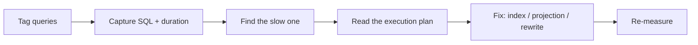

# Diagnosing Slow Queries

## 🧠 Intuition

"The app is slow" is a symptom. Diagnosing means **finding which query**, **seeing the SQL it
emits**, **measuring how long it takes**, and **reading the database's execution plan** to know
*why*. EF gives you the first three; the database gives you the last. A senior developer can go
from "this page is slow" to "this query needs this index" in minutes, with evidence.

> 💡 **Never optimize by guessing.** Capture, measure, read the plan, fix, re-measure. The slow
> thing is rarely where intuition says.

## 📐 The diagnosis pipeline



## 💻 Step 1 — Tag everything

```csharp
var blogs = await ctx.Blogs
    .TagWith("HomePage.Trending")     // shows up as a comment in the SQL
    .Where(b => b.Views > 1000)
    .ToListAsync();
```

Now the slow query in your logs/profiler carries `-- HomePage.Trending` — instantly traceable to
source. See [Query Tags & Diagnostics](../02-Querying/07.Query-Tags-and-Diagnostics.md).

## 💻 Step 2 — Capture SQL + duration

```csharp
// Dev: everything to console
opt.UseSqlServer(cs)
   .LogTo(Console.WriteLine, LogLevel.Information)
   .EnableSensitiveDataLogging();     // DEV ONLY — includes parameter values

// Prod: warnings to your structured logger; NO sensitive data
opt.UseSqlServer(cs)
   .LogTo(msg => logger.LogDebug("{Sql}", msg),
          new[] { DbLoggerCategory.Database.Command.Name }, LogLevel.Information);
```

A slow-query **interceptor** turns this into automatic alerting:

```csharp
public class SlowQueryInterceptor : DbCommandInterceptor {
    public override ValueTask<DbDataReader> ReaderExecutedAsync(
        DbCommand cmd, CommandExecutedEventData data, DbDataReader result, CancellationToken ct = default) {
        if (data.Duration.TotalMilliseconds > 200)
            Log.Warning("SLOW {Ms}ms {Sql}", data.Duration.TotalMilliseconds, cmd.CommandText);
        return ValueTask.FromResult(result);
    }
}
```

(See [Interceptors](../03-Saving-and-Concurrency/06.Interceptors-and-SaveChanges-Hooks.md).)

## 💻 Step 3 — Inspect SQL without running

```csharp
var sql = ctx.Blogs.Where(b => b.Views > 1000).Select(b => new { b.Id, b.Title }).ToQueryString();
Console.WriteLine(sql);
```

`ToQueryString()` (EF 5+) shows EF's generated SQL — perfect for catching surprises in code review
before they hit production.

## 💻 Step 4 — Read the execution plan (the database's job)

**SQL Server:**
```sql
SET STATISTICS IO, TIME ON;
-- paste the EF-generated SQL here and run it
-- look for: Table Scan / Clustered Index Scan (bad on big tables), high logical reads, missing index hints
```
Or view the actual graphical plan in SSMS / Azure Data Studio.

**PostgreSQL:**
```sql
EXPLAIN (ANALYZE, BUFFERS) SELECT ...;
-- look for: Seq Scan on big tables, high cost, rows estimate vs actual mismatch
```

The plan tells you *why*: a missing index, a non-sargable predicate (a function on a column
defeating the index), a bad join order, an implicit conversion.

## 💻 Step 5 — Common fixes

| Symptom in the plan | Fix |
|---------------------|-----|
| Table/Clustered Index **Scan** on a big table for a selective filter | Add an [index](../01-Modeling-Data/07.Indexes-and-Constraints.md) on the filtered column |
| Key Lookup back to the table | **Covering index** (`IncludeProperties`) |
| Predicate not using the index (`WHERE func(col) = x`) | Rewrite to be sargable / use a computed column |
| Huge result set | **Project** to a DTO; paginate (keyset) |
| Repeated near-identical queries | **N+1** → `Include`/projection |
| Cartesian explosion | `AsSplitQuery()` |
| Implicit conversion warning | Match parameter type to column type (e.g. `nvarchar` vs `varchar`) |

## ⚖️ Dev vs prod logging

| Setting | Dev | Prod |
|---------|-----|------|
| `LogTo(Console...)` | ✅ verbose | ❌ (use structured logger) |
| `EnableSensitiveDataLogging` | ✅ (handy) | ❌ (PII leak) |
| `EnableDetailedErrors` | ✅ | optional |
| Slow-query interceptor | ✅ | ✅ (alert on threshold) |
| OpenTelemetry EF instrumentation | optional | ✅ (end-to-end traces) |

## 🆕 Latest EF Notes (8 / 9 / 10)

- **EF 10** uses **human-readable parameter names** (`@blogId` instead of `@__blogId_0`) — captured
  SQL is far easier to paste into a plan tool and reason about.
- All versions support `TagWith`, `LogTo`, `ToQueryString`, command interceptors, and emit
  diagnostic events consumed by APM tools.

## 🌍 Real-world production tips

- Wire a **slow-query interceptor** + alert in every service. You'll catch regressions before
  users do.
- Use **OpenTelemetry** EF instrumentation so a slow query shows up inside the request trace
  (controller → EF → DB).
- Keep **`EnableSensitiveDataLogging` OFF in prod** — it writes parameter values (often PII) to
  logs.
- Re-measure after every fix. "I added an index" without a before/after number is not a fix.

## 🎯 Practice (with full solutions)

### 1. Full pipeline on a slow page — `Medium`
**Scenario:** `/dashboard` is slow. Walk the diagnosis.
**Solution:**
```csharp
// 1. Tag
var rows = await ctx.Orders.TagWith("Dashboard.Summary")
    .Where(o => o.TenantId == t && o.Status == "Open")
    .Select(o => new { o.Id, o.Total })
    .ToListAsync();
// 2. Capture SQL via LogTo / interceptor → find the SLOW line tagged Dashboard.Summary
// 3. ToQueryString() to see the exact SQL
// 4. Run it with SET STATISTICS IO, TIME ON → "Clustered Index Scan on Orders, 1.2M logical reads"
// 5. Fix: filtered covering index
modelBuilder.Entity<Order>()
    .HasIndex(o => new { o.TenantId, o.Status })
    .IncludeProperties(o => new { o.Total })
    .HasFilter("[Status] = 'Open'");
// 6. Re-measure → reads drop to a few hundred; page is fast.
```
**Why it's better:** evidence-driven. The index targets exactly the predicate + projection the
plan showed was scanning.

### 2. Catch a regression automatically — `Easy`
**Task:** Be alerted whenever any query exceeds 200ms in production.
**Solution:** register the `SlowQueryInterceptor` above and route its `Log.Warning` to your alerting
pipeline.
**Why it's better:** you find slow queries from telemetry, not from angry users.

## ✅ Key Takeaways

- Diagnose with a **pipeline**: tag → capture SQL + duration → inspect → read the **execution
  plan** → fix → re-measure.
- **`TagWith`**, **`LogTo`**, **`ToQueryString`**, and a **slow-query interceptor** are your EF
  tools; the **execution plan** is the database's.
- The plan tells you *why* (scan, key lookup, non-sargable predicate) → the fix is usually an
  index, a projection, or a rewrite.
- **`EnableSensitiveDataLogging` is dev-only.** Re-measure every fix.

**Self-check:**
1. What four signals do you gather before opening the execution plan?
2. What does a "Clustered Index Scan on a big table" usually mean, and how do you fix it?
3. Why must `EnableSensitiveDataLogging` stay off in production?

---
◀ Prev: [Bulk Operations Performance](04.Bulk-Operations-Performance.md) · ▲ [Module index](README.md) · ▶ Next module: [06 — Production](../06-Production/01.Dependency-Injection.md)
