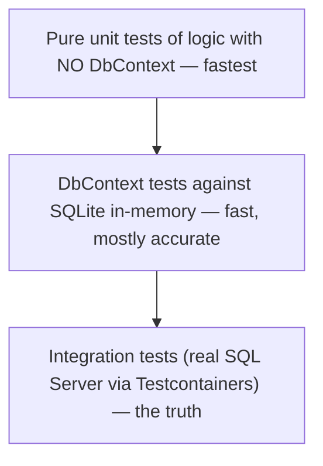

# Testing Strategy

## 🧠 Intuition

The hardest question in EF testing isn't "how do I write a test" — it's "**what should I test, and
against what?**". The trap is faking the database (the InMemory provider, or mocking `DbSet`)
because it's fast, then shipping bugs the fake couldn't catch. The senior approach: test your
**logic** against a **real relational engine** (SQLite or a containerized SQL Server), and don't
unit-test EF itself.

> 💡 **You don't test EF Core; the EF team does.** You test *your queries, mappings, and business
> logic* — and those only behave correctly against something that enforces real SQL semantics.

## 📐 The testing pyramid for EF



| Layer | Against | Speed | Catches |
|-------|---------|-------|---------|
| **Pure unit** | No DB — logic extracted from EF | Fastest | Business-rule bugs |
| **DbContext (SQLite in-memory)** | A real relational engine | Fast | Query translation, FK, constraints, most mapping |
| **Integration (Testcontainers)** | Your **actual** provider (SQL Server) | Slower | Provider-specific SQL, JSON, temporal, vector, migrations |

## 🚫 What NOT to do

### Don't mock `DbSet` / `DbContext`

```csharp
// ❌ Mocking DbSet — brittle, tests the mock not the behavior, breaks on async
var mockSet = new Mock<DbSet<Blog>>();
// ...endless setup to fake IQueryable, IAsyncEnumerable... and it still doesn't run real SQL
```

Mocking `DbSet` tests your *mock setup*, not your query. It can't catch translation errors,
constraint violations, or relationship bugs. Avoid it.

### Be wary of the InMemory provider

The `Microsoft.EntityFrameworkCore.InMemory` provider is **not a relational database**:
- No foreign-key enforcement.
- No transactions / isolation.
- No unique-constraint enforcement (historically).
- LINQ that throws on real SQL can silently pass.

It's officially **discouraged for testing query behavior**. If you want fast *and* accurate, use
**SQLite in-memory** (a real relational engine) instead — see
[Unit Testing DbContext](02.Unit-Testing-DbContext.md).

## 💻 The recommended split

### 1. Extract logic so most tests need no database

```csharp
// Pure function — testable with zero EF
public static decimal CalculateDiscount(Customer c, decimal subtotal) =>
    c.IsPremium && subtotal > 100 ? subtotal * 0.1m : 0;
```

Push business rules out of query methods so they can be unit-tested directly. The DB-touching code
becomes thin.

### 2. Test queries/mappings against SQLite in-memory

Fast, real relational semantics — catches FK violations, constraint breaks, and most translation
issues. The default for "does this repository method work?".

### 3. Test provider-specific features against the real provider

JSON columns, temporal tables, HierarchyId, vector search, and **migrations** behave differently
per provider — test those against **SQL Server via Testcontainers**
([Integration Testing](03.Integration-Testing-with-Testcontainers.md)).

## ⚖️ Choosing per scenario

| Testing… | Use |
|----------|-----|
| A pricing rule, a validation | Pure unit test (no DB) |
| A repository's LINQ query, FK behavior | SQLite in-memory |
| A SQL-Server-specific feature (JSON `json` type, temporal, vector) | Testcontainers + SQL Server |
| A migration actually applies cleanly | Testcontainers + SQL Server |
| End-to-end API behavior | Integration test + WebApplicationFactory + Testcontainers |

## 🆕 Latest EF Notes (8 / 9 / 10)

- The guidance to **prefer SQLite/real DB over InMemory** has been Microsoft's official position
  for several versions and remains so in EF 10.
- **EF 10** features like the **vector type**, **SQL 2025 `json`**, and **named filters** are
  provider-specific — they *must* be tested against the real provider, not SQLite/InMemory.

## 🌍 Real-world production tips

- **Most tests: pure unit + SQLite in-memory.** **Critical paths + provider features:
  Testcontainers.**
- **Never mock `DbSet`.** If you feel the urge, extract the logic instead.
- Run Testcontainers integration tests in CI (they need Docker) — they catch the bugs SQLite can't.
- Seed deterministic data per test; isolate tests (fresh DB or transaction-per-test rollback).

## 🎯 Practice (with full solutions)

### 1. Pick the right layer — `Easy`
**Task:** Choose the test approach for: (a) "premium customers over $100 get 10% off";
(b) "GetActiveBlogs filters soft-deleted rows"; (c) "the `Details` JSON column round-trips on SQL
Server"; (d) "migration `AddRating` applies without error".
**Solution:**
(a) **Pure unit test** — extract `CalculateDiscount`, no DB needed.
(b) **SQLite in-memory** — real query + query filter, fast.
(c) **Testcontainers + SQL Server** — JSON column behavior is provider-specific.
(d) **Testcontainers + SQL Server** — migrations generate provider-specific SQL.
**Why it matters:** matching the layer to what you're verifying keeps tests both fast *and*
trustworthy.

### 2. Refactor away a DbSet mock — `Medium`
**Smelly code:** a service method with complex pricing logic, tested by mocking `DbSet<Order>`.
**Task:** make it testable without mocking EF.
**Solution:** extract the pricing into a pure function, unit-test that directly; test the thin
data-access wrapper against SQLite in-memory.
```csharp
// pure, no EF:
public static decimal Total(IEnumerable<OrderLine> lines) => lines.Sum(l => l.Price * l.Qty);
// data access tested against SQLite in-memory separately
```
**Why it's better:** the logic gets fast, reliable unit tests; the query gets a real-engine test;
no brittle mock of `IQueryable`/`IAsyncEnumerable`.

## ✅ Key Takeaways

- **Don't test EF; test your code.** Extract logic into pure functions where you can.
- **Don't mock `DbSet`** — it tests the mock, not the behavior.
- **Avoid the InMemory provider** for query behavior — use **SQLite in-memory** (real relational
  engine).
- **Provider-specific features and migrations → Testcontainers + the real provider.**
- Match the **test layer** to **what you're verifying**.

**Self-check:**
1. Why is mocking `DbSet` a bad idea?
2. What can the InMemory provider *not* catch that SQLite can?
3. Which features force you to use a real SQL Server in tests?

---
◀ Prev: [Module index](README.md) · ▲ [Module index](README.md) · ▶ Next: [Unit Testing DbContext](02.Unit-Testing-DbContext.md)
