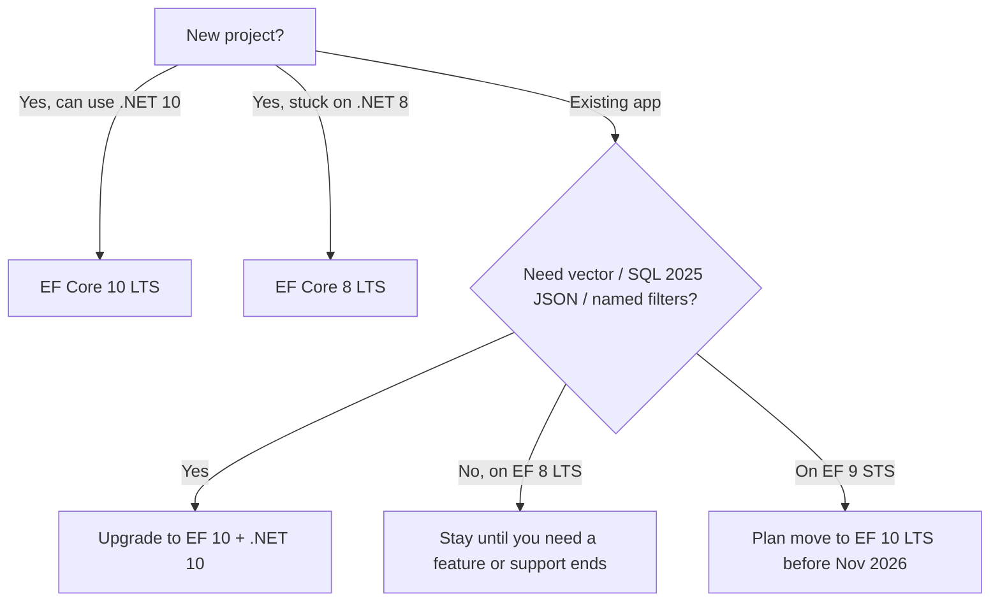

# Version Compatibility Cheatsheet

> Quick reference for EF Core versions, .NET targets, support windows, and upgrade planning.

## 📅 Support lifecycle at a glance

| EF Core | Released | Support type | Supported until | .NET required |
|---------|----------|--------------|-----------------|---------------|
| **EF Core 10** | Nov 2025 | **LTS** | **Nov 10, 2028** | .NET 10 |
| EF Core 9 | Nov 2024 | STS | Nov 10, 2026 | .NET 8 (runs on 8 or 9) |
| **EF Core 8** | Nov 2023 | **LTS** | **Nov 10, 2026** | .NET 8 |
| EF Core 7 | Nov 2022 | STS | (ended) | .NET 6/7 |
| EF Core 6 | Nov 2021 | LTS | (ended) | .NET 6 |

**LTS** (Long-Term Support) = ~3 years. **STS** (Short-Term Support) = ~18 months. Microsoft
alternates: even-numbered .NET releases are LTS, odd are STS — and EF tracks the same cadence.

> 💡 **For new long-lived apps:** target **EF 10** (LTS, newest). **Can't move to .NET 10 yet?**
> Stay on **EF 8** (LTS). Avoid building new long-term systems on an STS release unless you'll keep
> upgrading.

## 🔑 The hard version rules

- **EF Core major version ≈ .NET major version.** EF 10 needs .NET 10; EF 8 needs .NET 8.
- EF 9 (STS) targets .NET 8, so it runs on **.NET 8 (LTS) or .NET 9**.
- EF does **not** run on .NET Framework (use EF6 there — a different product).
- Keep `EntityFrameworkCore`, your **provider**, and `*.Design`/`*.Tools` on the **same
  major.minor**.

## 🧭 Which features need which version

| Feature | Min EF version | Notes |
|---------|----------------|-------|
| Complex types | EF 8 | optional/JSON/collections in EF 10 |
| Primitive collections | EF 8 | read-only variants in EF 9 |
| JSON columns (`OwnsOne(...).ToJson()`) | EF 8 | native SQL 2025 `json` type in EF 10 |
| HierarchyId | EF 8 | Azure SQL support in EF 9 |
| `DateOnly` / `TimeOnly` on SQL Server | EF 8 | native on other providers earlier |
| `Database.SqlQuery<T>` | EF 8 | raw SQL → primitives/DTOs |
| `ExecuteUpdate` / `ExecuteDelete` | EF 7 | non-expression lambdas + JSON in EF 10 |
| MSBuild compiled model | EF 9 | `<EFOptimizeContext>true</EFOptimizeContext>` |
| `UseAzureSql` / `UseAzureSynapse` | EF 9 | Azure-tuned SQL |
| Cosmos rewrite (`$type`, `ToPageAsync`, partition-key extraction) | EF 9 | breaking changes for existing Cosmos data |
| **Vector data** + `VECTOR_DISTANCE` | EF 10 | SQL Server 2025 / Azure SQL |
| **SQL Server 2025 native `json` type** | EF 10 | auto on compat ≥ 170 / `UseAzureSql` |
| **LeftJoin / RightJoin** LINQ operators | EF 10 | matches .NET 10 LINQ |
| **Named query filters** | EF 10 | multiple per entity, selective bypass |
| Cosmos full-text search | EF 10 | `EF.Functions.FullTextContains` |

## 🚀 Upgrade tips

### EF 8 → EF 10
- Bump the project to **.NET 10** and EF packages to **10.0.\***.
- Review **breaking changes** (Microsoft's EF 10 breaking-changes page).
- Watch the **JSON column auto-migration**: existing `nvarchar(max)` JSON becomes the native
  `json` type on the next migration (on SQL 2025 / `UseAzureSql`). Opt out by pinning the column
  type if you're not ready.
- Migrations now apply **per-step** (EF 9's single transaction was reverted) — no action needed,
  just be aware.

### EF 9 → EF 10
- Already on .NET 9? You still need **.NET 10** for EF 10.
- The EF 9 collection-parameterization knobs (`EF.Constant`/`EF.Parameter`) still work; EF 10's
  **padding** is the new default.

### General upgrade hygiene
1. Upgrade in a branch; run the full test suite (especially **Testcontainers** integration tests —
   they catch provider SQL changes).
2. Re-generate and **review migrations** after upgrading — generated SQL can change between versions.
3. Add **`dotnet ef migrations has-pending-model-changes`** to CI so model drift fails the build.
4. Read the version's **breaking-changes** page before merging.

## ⚖️ Decision guide

## ✅ Key Takeaways

- **EF 10 = LTS to Nov 2028, requires .NET 10.** **EF 8 = LTS to Nov 2026, .NET 8.** EF 9 = STS.
- EF major version is tied to the **.NET major version**; keep all EF packages on the same
  major.minor.
- New long-lived apps: **EF 10** (or EF 8 if stuck on .NET 8). Avoid building long-term on STS.
- Upgrading: review breaking changes, re-check migrations, lean on integration tests, watch the
  **JSON auto-migration** in EF 10.

**Self-check:**
1. Which EF versions are LTS, and until when?
2. What .NET version does EF 10 require?
3. What should you watch for in migrations when upgrading EF 8 → EF 10 on SQL Server 2025?

---
◀ Prev: [What's New in EF Core 8](03.EF-Core-8.md) · ▲ [Module index](README.md) · ▶ Next module: [09 — Beyond](../09-Beyond/01.EF-Anti-Patterns.md)
