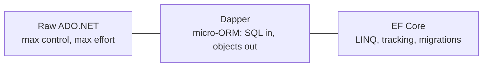

# EF Core vs Dapper vs Raw ADO.NET

## 🧠 Intuition

There is no "best" data-access tool — only the right tool for a given job. EF Core, Dapper, and
raw ADO.NET sit on a spectrum from **most abstraction / fastest development** to **most control /
most effort**. Senior developers don't pick one religiously; they **mix** them, using EF for the
domain and write-side, and dropping to Dapper or raw SQL for hot read paths.

> 💡 **The decision isn't EF *or* Dapper. It's EF *and*, occasionally, Dapper** — in the same app,
> for different jobs.

## 📐 The spectrum



| | **EF Core** | **Dapper** | **Raw ADO.NET** |
|--|-------------|------------|-----------------|
| You write | Entities + LINQ | SQL + small POCOs | SQL + commands + readers |
| Query authoring | LINQ → SQL (generated) | You write the SQL | You write everything |
| Change tracking | ✅ automatic | ❌ | ❌ |
| Migrations | ✅ built-in | ❌ | ❌ |
| Relationships / graphs | ✅ | manual (multi-mapping) | manual |
| Control over exact SQL | partial | **full** | **full** |
| Dev speed | **fastest** | fast | slowest |
| Raw read speed | very good (tuned) | **excellent** | **excellent** |
| Best at | domain logic, CRUD, multi-provider | hot read queries, reporting | drivers, extreme perf, bulk |

## 💻 Same task, three ways

```csharp
// EF Core — LINQ, tracked or projected
var blogs = await ctx.Blogs.Where(b => b.Views > 1000)
    .Select(b => new BlogDto(b.Id, b.Title)).ToListAsync();

// Dapper — you write the SQL, it maps the rows
using var conn = new SqlConnection(cs);
var blogs = await conn.QueryAsync<BlogDto>(
    "SELECT Id, Title FROM Blogs WHERE Views > @min", new { min = 1000 });

// Raw ADO.NET — you do everything
using var conn = new SqlConnection(cs);
await conn.OpenAsync();
using var cmd = new SqlCommand("SELECT Id, Title FROM Blogs WHERE Views > @min", conn);
cmd.Parameters.AddWithValue("@min", 1000);
using var reader = await cmd.ExecuteReaderAsync();
var blogs = new List<BlogDto>();
while (await reader.ReadAsync())
    blogs.Add(new BlogDto(reader.GetInt32(0), reader.GetString(1)));
```

Same result, decreasing abstraction, increasing ceremony.

## ⚖️ When to choose which

### Choose **EF Core** when…
- You have a **rich domain** with relationships, CRUD across many entities, and business rules.
- You want **migrations, change tracking, DI** out of the box.
- You may target **multiple providers** (SQL Server prod, SQLite tests).
- **Maintainability** matters more than squeezing the last 10% of read perf.

### Choose **Dapper** when…
- A **hot read path** (a dashboard, a high-QPS endpoint) needs hand-tuned SQL.
- A **complex reporting query** (window functions, pivots, CTEs) that EF translates awkwardly or
  not at all.
- You want minimal overhead and full control of the SQL, but still want object mapping.

### Choose **raw ADO.NET / SqlBulkCopy** when…
- **Bulk data movement** (millions of rows) — `SqlBulkCopy` / `COPY`.
- You're writing a **driver/library** or need to control every allocation.
- A niche that neither EF nor Dapper handles well.

## 💻 The senior pattern: mix them

```csharp
// EF for the domain + writes
public class OrderService {
    private readonly AppDbContext _ctx;
    public OrderService(AppDbContext ctx) => _ctx = ctx;
    public async Task PlaceAsync(Order o) { _ctx.Orders.Add(o); await _ctx.SaveChangesAsync(); }
}

// Dapper for a hot reporting read — reuse EF's connection so it shares the transaction/pool
public class SalesReport {
    private readonly AppDbContext _ctx;
    public SalesReport(AppDbContext ctx) => _ctx = ctx;
    public Task<IEnumerable<DailySales>> DailyAsync() =>
        _ctx.Database.GetDbConnection().QueryAsync<DailySales>("""
            SELECT CAST(PlacedUtc AS date) AS Day, SUM(Total) AS Total
            FROM Orders GROUP BY CAST(PlacedUtc AS date) ORDER BY Day
        """);
}
```

You can call Dapper on **EF's own connection** (`ctx.Database.GetDbConnection()`), so they share
the connection pool and (if you pass it) the transaction. Best of both worlds.

## 🆕 Modern notes

- **EF 10** narrows the gap further: `SqlQuery<T>` for raw-SQL DTOs, `LeftJoin/RightJoin`, vector,
  and JSON support mean EF now handles many things you'd previously have dropped to Dapper for.
- **Dapper.AOT** and source-generated mapping push Dapper's perf and trimming/AOT story forward.
- For **true bulk**, neither ORM is the tool — `SqlBulkCopy` / `COPY` / `EFCore.BulkExtensions`.

## 🎯 Practice (with full solutions)

### 1. Pick the tool — `Easy`
**Task:** Choose for each: (a) a 40-screen admin CRUD app; (b) a `/leaderboard` endpoint hit
20k×/sec with a 6-table aggregate; (c) nightly load of 8M rows from a partner feed.
**Solution:**
(a) **EF Core** — CRUD, migrations, DI all pay off.
(b) **Dapper** for that endpoint (hand-tuned SQL, minimal overhead) — keep EF for the rest of the
   app.
(c) **`SqlBulkCopy` / `COPY` / BulkExtensions** in a background job — not an ORM job.
**Why it matters:** one app, three tools, each matched to the job.

### 2. Add a Dapper read to an EF app — `Medium`
**Task:** A reporting query is slow through EF. Add a Dapper read that shares EF's connection.
**Solution:**
```csharp
using Dapper;
public Task<IEnumerable<TenantTotal>> TotalsAsync() =>
    _ctx.Database.GetDbConnection().QueryAsync<TenantTotal>("""
        SELECT TenantId, SUM(Amount) AS Total
        FROM Orders WHERE Status = 'Open'
        GROUP BY TenantId
    """);
public record TenantTotal(int TenantId, decimal Total);
```
**Why it's better:** the exact SQL you want, mapped to a DTO, on EF's pooled connection — no second
connection, no second configuration.

## ✅ Key Takeaways

- It's a **spectrum**: raw ADO.NET (control) → Dapper (SQL + mapping) → EF Core (LINQ + tracking +
  migrations).
- **EF for the domain & writes; Dapper for hot reads/reporting; raw/bulk for massive data.**
- You can run **Dapper on EF's own connection** — mix them in one app.
- **EF 10 narrows the gap** (SqlQuery, joins, vector, JSON), but the right answer is still "match
  the tool to the job."

**Self-check:**
1. What does EF give you that Dapper doesn't, and vice versa?
2. How can EF and Dapper share a connection in the same app?
3. For an 8M-row nightly import, which tool — and why not EF?

---
◀ Prev: [EF Anti-Patterns](01.EF-Anti-Patterns.md) · ▲ [Module index](README.md) · ▶ Next: [Study Plan](03.Study-Plan.md)
